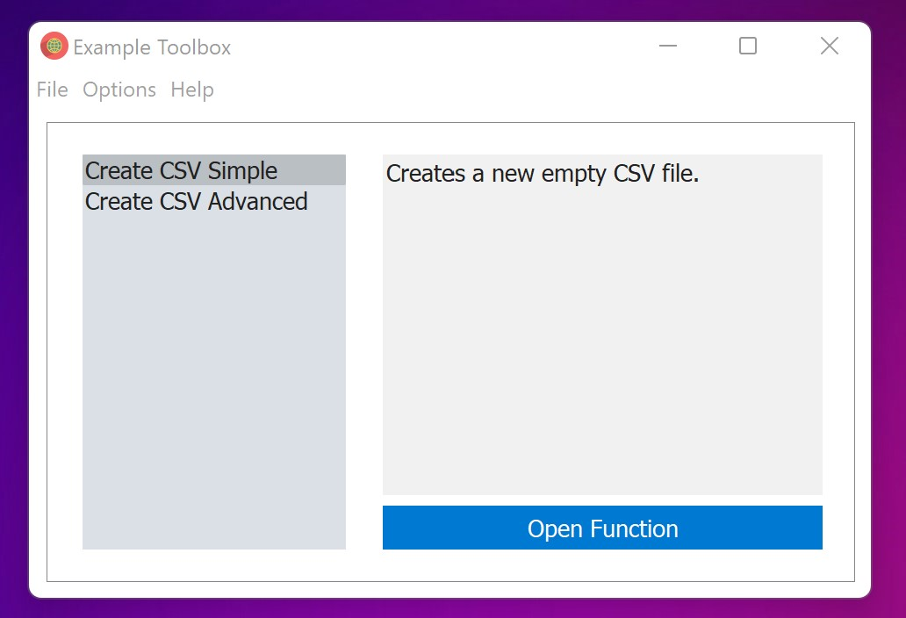
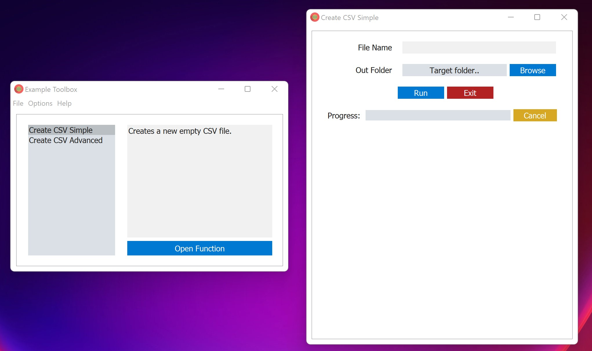
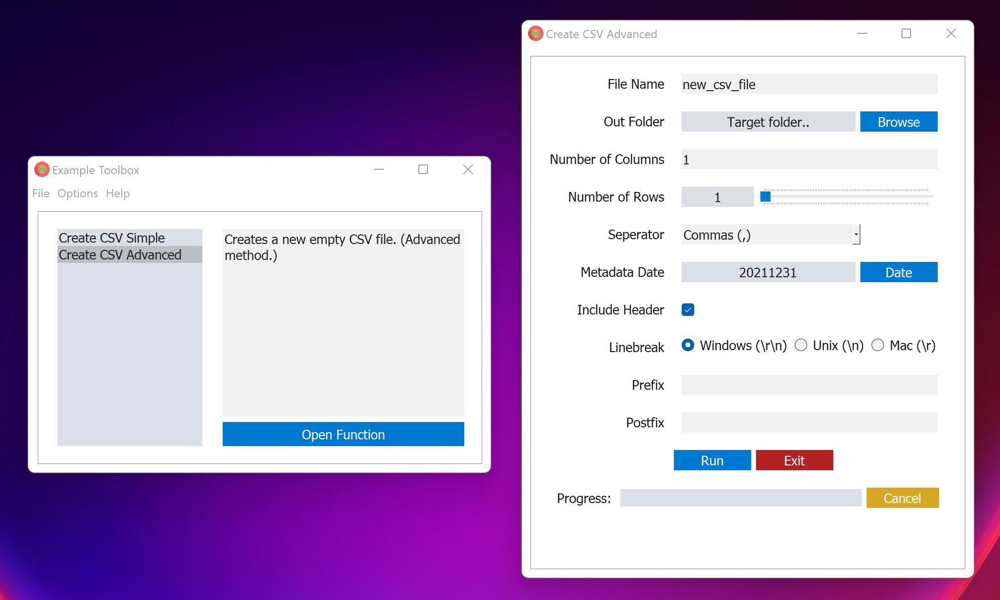

# toolbox-gui
Create a gui for a function toolbox. Supports the following input types:
- "file_open"
- "file_save"
- "file_open_multiple"
- "number"
- "boolean"
- "radio"
- "dropdown"
- "slider"
- "string"
- "password"
- "date_year"
- "folder_open"
- "folder_save"




First create or import a function to add:
```python
    import os

    # Example function simple
    def add_line_to_csv(file_path, line):
        with open(file_path, "a") as file:
            file.write(line + "\n")

        return 1

    # Example function advanced
    def create_csv_file(
        name,
        folder,
        cols=1,
        rows=1,
        seperator=",",
        other_seperator=None,
        metadata_date="today",
        include_header=True,
        linebreak="rn",
        prefix="",
        postfix="",
    ):
        file_path = os.path.join(folder, prefix + name + postfix + ".csv")

        with open(file_path, "w") as file:
            file.write("")

        return file_path
```

Then define the parameters of the tools:
```python
    tools = {}

    tools["Create CSV Simple"] = {
        "description": "Creates a new empty CSV file.",
        "function": create_csv_file,
        "parameters": [
            {
                "name": {
                    "type": "string",
                    "display_name": "File Name",  # optional default (parameter name)
                    "default": "",  # optional default ("")
                    "tooltip": "The name of the csv file to create.",  # optional default ("")
                }
            },
            {
                "out_folder": {
                    "type": "folder_open",
                    "display_name": "Out Folder",  # optional default (parameter name)
                    "tooltip": "The path to folder to save the CSV file.",  # optional default ("")
                }
            },
        ],
    }
```



```python

    tools["Create CSV Advanced"] = {
        "description": "Creates a new empty CSV file. (Advanced method.)",
        "function": create_csv_file,
        "parameters": [
            {
                "name": {
                    "type": "string",
                    "display_name": "File Name",  # optional default (parameter name)
                    "default": "new_csv_file",  # optional default ("")
                    "min_length": 1,  # optional default (0)
                    "tooltip": "The name of the csv file to create.",  # optional default ("")
                }
            },
            {
                "out_folder": {
                    "type": "folder_open",
                    "display_name": "Out Folder",  # optional default (parameter name)
                    "tooltip": "The path to folder to save the CSV file.",  # optional default ("")
                }
            },
            {
                "cols": {
                    "type": "number",
                    "min_value": 0,
                    "max_value": 100,
                    "display_name": "Number of Columns",  # optional default (parameter name)
                    "default": 1,  # optional default (0)
                    "keyword": True,  # optional default (False)
                    "tooltip": "The number of columns in the CSV file.",  # optional default ("")
                }
            },
            {
                "rows": {
                    "type": "slider",
                    "min_value": 0,
                    "max_value": 100,
                    "step": 1,
                    "display_name": "Number of Rows",  # optional default (parameter name)
                    "default": 1,  # optional default (min_value)
                    "keyword": True,  # optional default (False)
                    "tooltip": "The number of rows in the CSV file.",  # optional default ("")
                }
            },
            {
                "seperator": {
                    "type": "dropdown",
                    "options": [
                        {"label": "Commas (,)", "value": ",", "default": True},
                        {"label": "Tabs (  )", "value": "\t"},
                        {"label": "Spaces ( )", "value": " "},
                        {"label": "Semicolons (;)", "value": ";"},
                        {"label": "Colons (:)", "value": ":"},
                        {"label": "Dashes (-)", "value": "-"},
                        {"label": "Underscores (_)", "value": "_"},
                        {"label": "Dots (.)", "value": "."},
                        {"label": "Bars (|)", "value": "|"},
                        {"label": "Other..", "value": "other"},
                    ],
                    "display_name": "Seperator",  # optional default (parameter name)
                    "keyword": True,  # optional default (False)
                    "tooltip": "The seperator to use in the CSV file.",  # optional default ("")
                }
            },
            {
                "other_seperator": {
                    "type": "string",
                    "display_name": "Other Seperator",  # optional default (parameter name)
                    "max_length": 4,  # optional default (inf)
                    "default": ",",  # optional default ("")
                    "enabled_by": {"seperator": ["other"]},  # optional default (None)
                    "keyword": True,  # optional default (False)
                    "tooltip": "The seperator to use in the CSV file.",  # optional default ("")
                }
            },
            {
                "metadata_date": {
                    "type": "date_year",
                    "display_name": "Metadata Date",  # optional default (parameter name)
                    "default": "today",  # optional (defaults to today) options are: days_ago_x, today, tomorrow, yesterday, or a specific date
                    "keyword": True,  # optional default (False)
                    "tooltip": "The date to use in the metadata.",  # optional default ("")
                }
            },
            {
                "include_header": {
                    "type": "boolean",
                    "display_name": "Include Header",  # optional default (parameter name)
                    "default": True,  # optional default (False)
                    "keyword": True,  # optional default (False)
                    "tooltip": "Include a header row in the CSV file.",  # optional default ("")
                }
            },
            {
                "linebreak": {
                    "type": "radio",
                    "options": [
                        {
                            "label": "Windows (\\r\\n)",
                            "key": "windows",
                            "value": "\r\n",
                            "default": True,
                        },
                        {"label": "Unix (\\n)", "key": "linux", "value": "\n"},
                        {"label": "Mac (\\r)", "key": "macos", "value": "\r"},
                    ],
                    "display_name": "Linebreak",  # optional default (parameter name)
                    "tooltip": "The linebreak to use in the CSV file.",  # optional default ("")
                    "keyword": True,  # optional default (False)
                }
            },
            {
                "prefix": {
                    "type": "string",
                    "display_name": "Prefix",  # optional default (parameter name)
                    "default": "",  # optional default ("")
                    "keyword": True,  # optional default (False)
                    "tooltip": "Prefix to add to the file name.",  # optional default ("")
                }
            },
            {
                "postfix": {
                    "type": "string",
                    "display_name": "Postfix",  # optional default (parameter name)
                    "default": "",  # optional default ("")
                    "keyword": True,  # optional default (False)
                    "tooltip": "Postfix to add to the file name.",  # optional default ("")
                }
            },
        ],
    }

    if __name__ == "__main__":
        from toolbox_creator.gui import create_gui

        create_gui(tools, name="Example Toolbox")
```




python -m build

python -m twine upload --repository testpypi dist/*